# 🚖 Ttag – Tourist Transportation App for Antalya

**Ttag** is a local mobile transportation app designed to provide safe and convenient travel experiences for tourists in and around Antalya. Users can sign up either as a **Passenger** or a **Driver**, and take advantage of real-time location-based transportation services.

---

## 🎯 Key Features

- 🧍‍♂️ **Passenger Role**
  - Select destination from current location
  - Request a ride and view fare (fixed or distance-based)
  - Browse available vehicles in the system
  - View ride history
  - View and update profile information

- 🚗 **Driver Role**
  - Receive ride requests from nearby passengers
  - Navigate to passenger’s location
  - Add, edit, or delete their own vehicles
  - Manage ride progress in real time
  - View and update profile information

- 📍 Real-time location & map integration  
- 🌙 **Light and Dark Theme Support**  
- 🌐 **Multilingual Support (Turkish and English)**  
- ⚙️ Backend powered by .NET Web API

---

## 🧱 Tech Stack & Architecture

| Layer | Technologies |
|-------|--------------|
| 💻 **Language & UI** | Kotlin, Jetpack Compose |
| 🧠 **Architecture** | MVVM, Clean Architecture, Repository Pattern |
| 🌐 **Navigation** | Jetpack Navigation Component |
| 🧑‍🎨 **UI Support** | Dynamic Theming (Light/Dark), Multilingual UI (TR/EN) |
| ☁️ **Backend** | .NET Web API (RESTful services) |
| 🔐 **Auth & DB** | Azure Authentication, Azure Cosmos DB / SQL  |
| 🗺️ **Maps & Location** | Google Maps SDK, Fused Location Provider |
| 🔄 **State Management** | StateFlow, LiveData |
| 🧪 **Testing** | JUnit, Mockito |
| ⏱️ **Async & Coroutines** | Kotlin Coroutines, ViewModelScope |
| 📡 **Networking** | Retrofit |

---

## 🖼️ Screenshots

> ### 🚗 Driver - Dark Theme
>
> <div align="center">
>   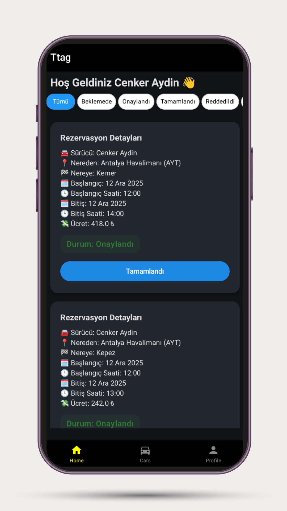
>   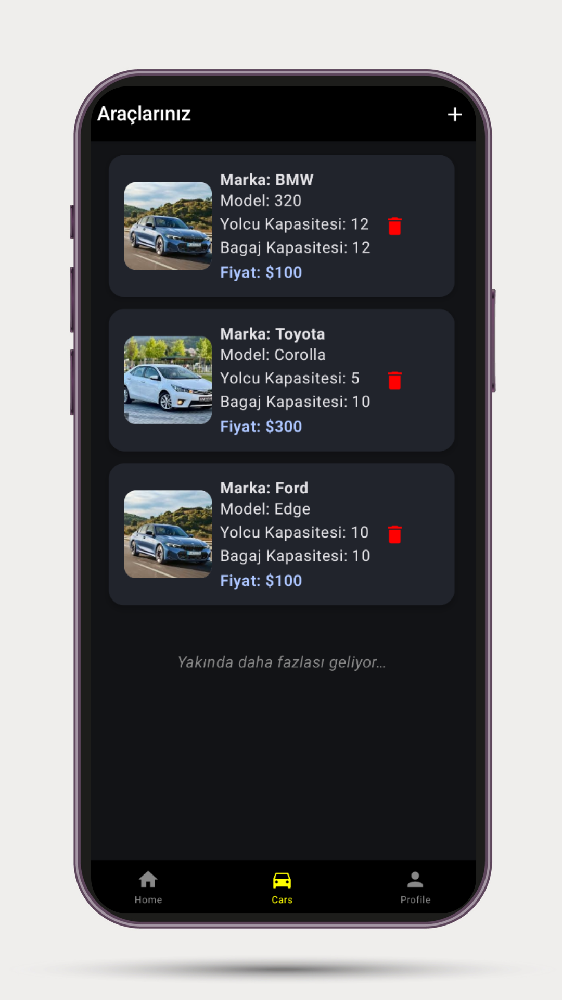
>   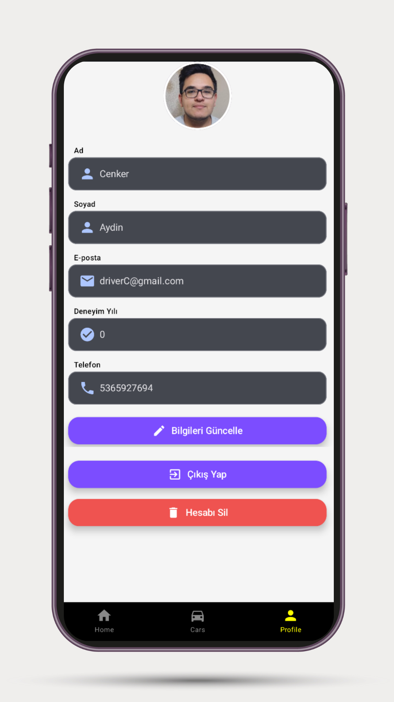
> </div>


> ### 🧍‍♂️ User - Dark Theme
> <div align="center" style="border:1px solid #ccc; padding:16px; border-radius:8px;">
>
>  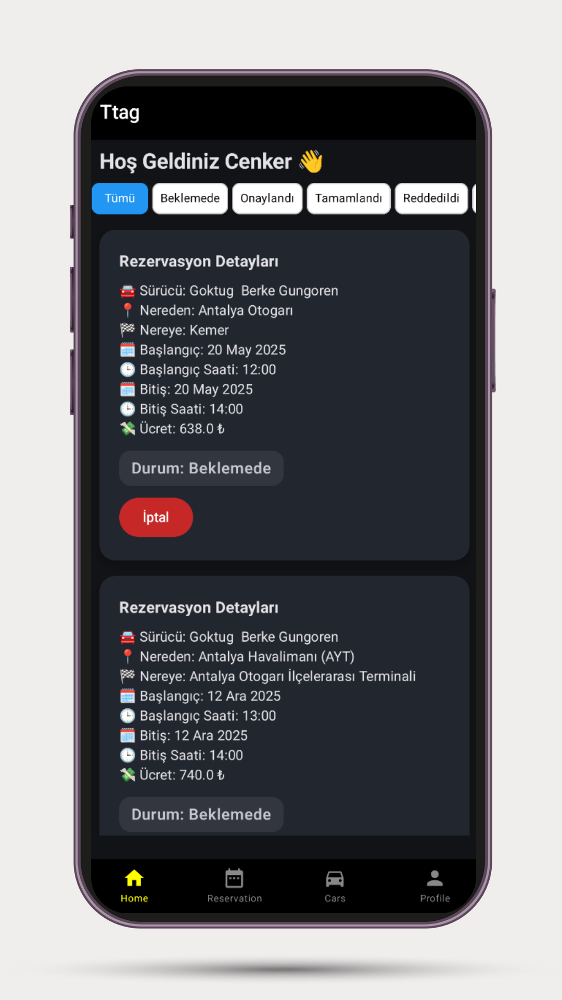
>  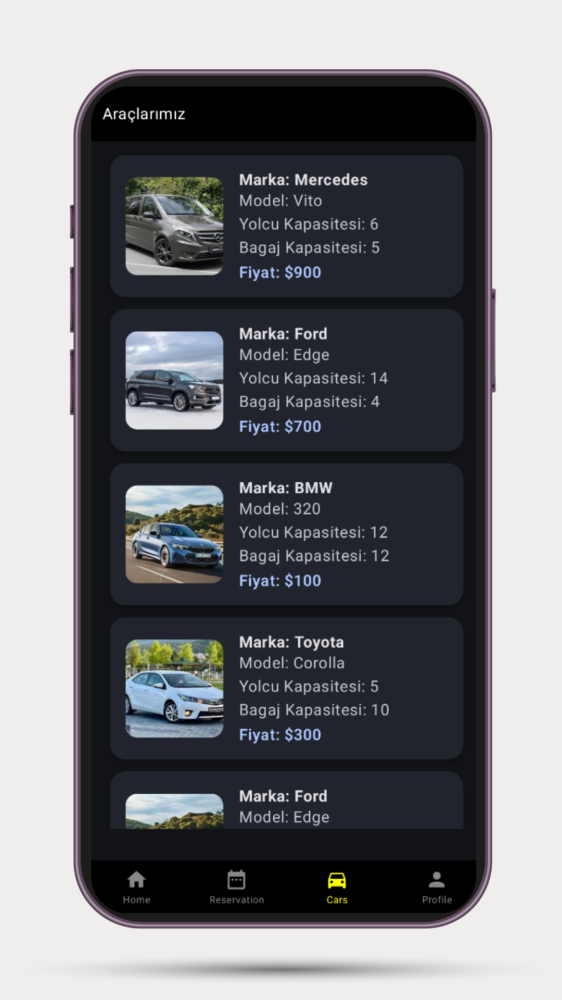
>  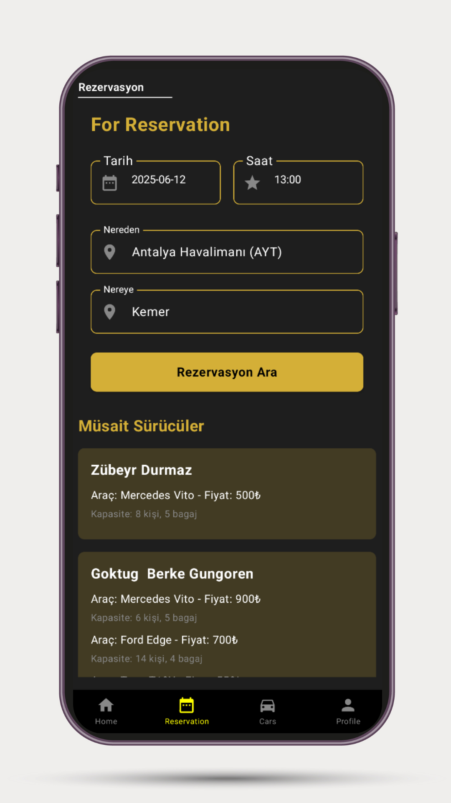
>  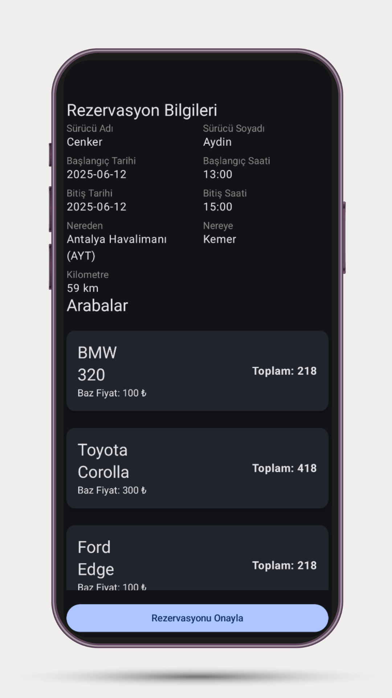
> </div>

>### 🚗 Driver - Light Theme
> <div align="center" style="border:1px solid #ccc; padding:16px; border-radius:8px;">
> 
>   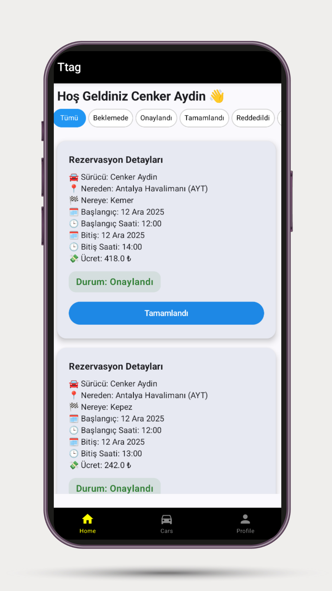
>  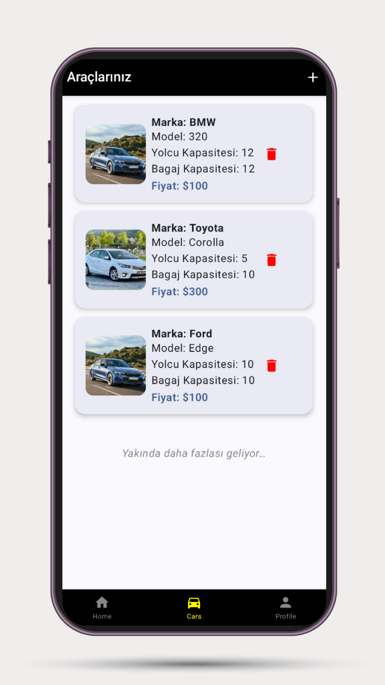
>  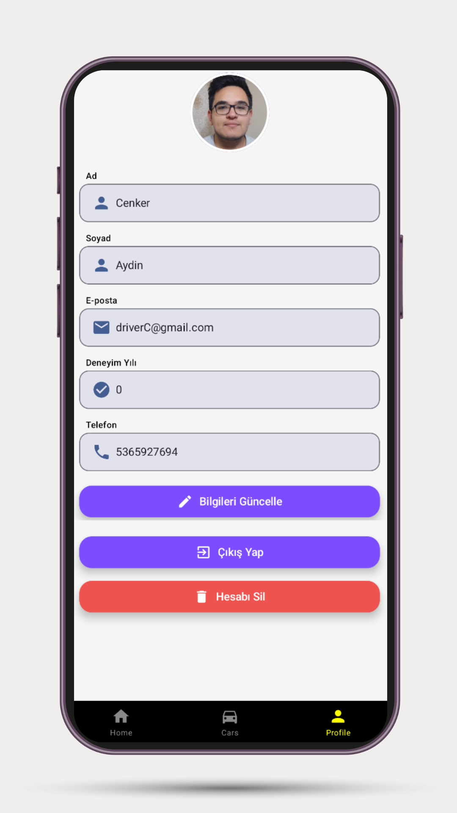
> </div>

> ### 🧍‍♂️ User - Light Theme
> <div align="center" style="border:1px solid #ccc; padding:16px; border-radius:8px;">
> 
>   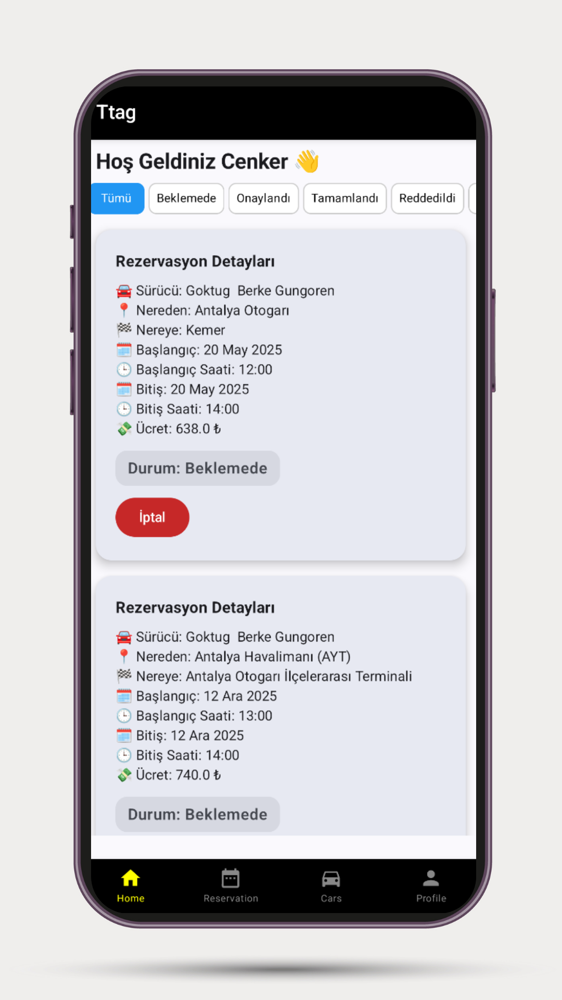
>   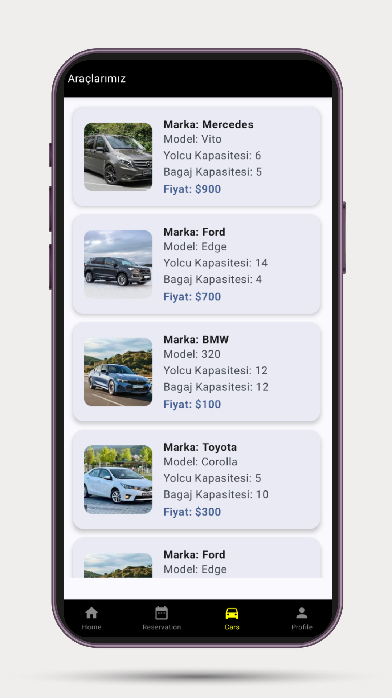
>   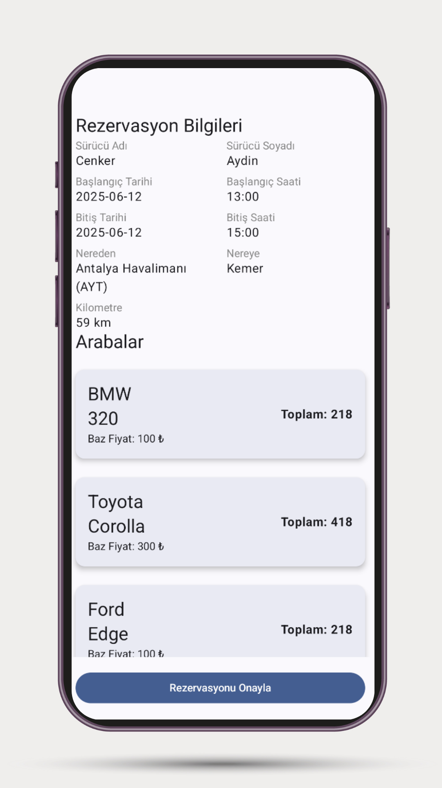
> </div>


# 🧪 Test Documentation – Project Validation Summary

This document serves as a comprehensive overview confirming that the project components have been thoroughly tested and validated to meet quality standards and functional requirements.

---

## 🎯 Test Scope & Objectives

- ✅ **Functionality Testing**  
  Ensured that all core features perform as expected under various scenarios.

- ✅ **UI/UX Verification**  
  Confirmed that the user interface renders correctly across supported devices and themes (Light/Dark).

- ✅ **Performance & Stability**  
  Validated app responsiveness and stability during normal and peak usage.

- ✅ **Localization Accuracy**  
  Verified multilingual support and appropriate language rendering.

- ✅ **Security & Authentication**  
  Tested authentication flows and data protection mechanisms.

---

## 🛠️ Testing Tools & Frameworks

| Aspect             | Tools & Frameworks                |
|--------------------|---------------------------------|
| Unit Testing       | JUnit, Mockito                  |
| UI Testing         | Espresso, Compose Testing       |
| API Testing        | Postman, Retrofit Mocking       |
| Performance Testing | Android Profiler, LeakCanary    |
| Localization Checks| Manual and Automated Scripts    |

---

## ✅ Conclusion

All critical components have passed rigorous testing and the application is stable, performant, and ready for deployment. Continuous integration pipelines are in place to maintain quality throughout future development cycles.


🚀 *Thank you for trusting in quality.*  


## 🤝 Contributing

We welcome contributions!

```bash
fork → clone → new branch → develop → commit → pull request
